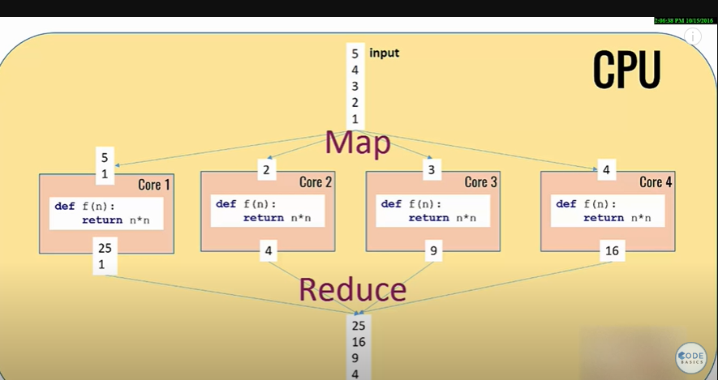

What is Multi Task?

Multi Task
-----------------------
- Multiporcessing and multithreading are multitasking
- Multiprocessing uses two or more CPUs to increase computing power, whereas multithreading uses a single process with multiple code segments to increase computing power. Summarry:

  - Thread share the same space/address/pipeline
  - Process not share same same/address/pipeline

Pool
---------------------

- Pool using multiples cores to do same task
- Pool the same function/code in each core avaliable
- MAp is way to broadcasting values on array/matrix
- Reduce is way to retrive results from core returns from values brodcasted.s

Multiprocessing queue
---------------------
import multiprocesing
q = multiprocessing.Queeu()

- Lives in share memory
- Used to share data between processes

Queue Module
------------

import queue
q = queue.Queue()

- lives in in-process memory
- Used to share data between threads